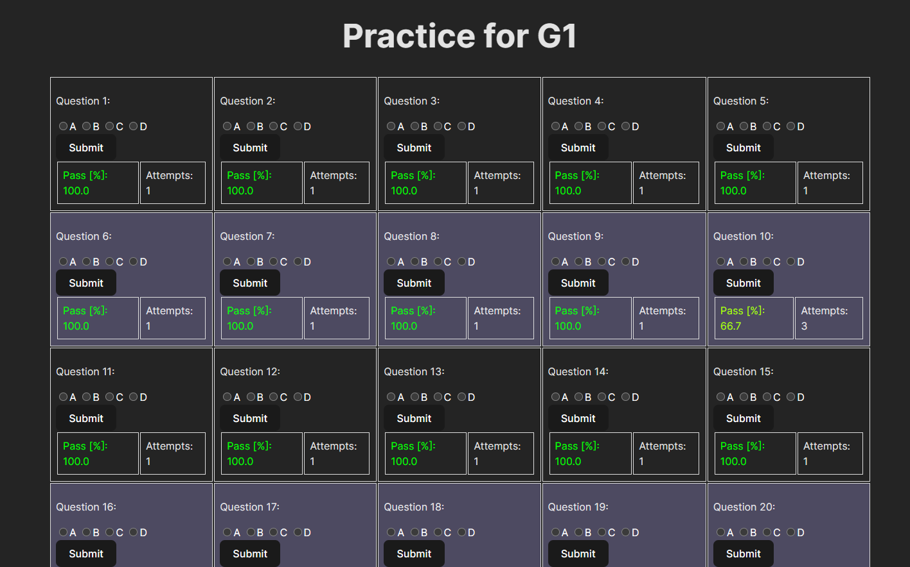

# Practice For Ontario G1 Test: Frontend

This program is the frontend component of the *Practice For Ontario G1 Test* project. It works with the [Practice For Ontario G1 Test: Backend](https://github.com/joejeye/g1practice-backend) developed with Spring Boot and MySQL.

## Overview

This program helps you keep track of your progress in preparation for Ontario G1 test. You need to buy the *Ontario Driver's Study Guide* (cover shown in the following figure) in order to access the test questions.


The web page looks like the following figure. You answer each question by choosing one of the four chioces A, B, C, D. After you click the submit button, the pass rate and the number of attempts for this quesiton are updated immediately. The history of attempts is stored in your local MySQL database and therefore persists through program restarts.


## Build

### Dependency: Node.js
Node.js is required to build the program. See [How to install Node.js](https://nodejs.org/en/learn/getting-started/how-to-install-nodejs) if you do not have it.

Change into the root directory and run
```sh
npm install
```
to resolve other dependencies.

### Build React.js with Vite

Run the following command
```sh
npm run build
```
Then you will find a directory `dist` created in the root directory.

## Run

You need to run the backend program before this frontend program. See the **link** for instructions on how to run the backend program.

While the backend is running, run the following command
```sh
npx vite
```
and then go to the link http://localhost:5173 in your browser.